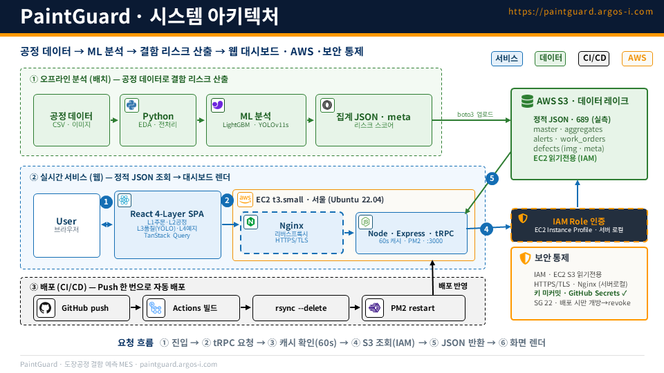

# PaintGuard — 자동차 도장공정 AI 결함 탐지 & 4-Layer MES

**🌐 [English](README.md) · 한국어**

**결함을 탐지하고, 리스크를 점수화하고, 4-Layer MES 웹앱으로 제공하는 듀얼 트랙 ML 시스템 — 모델부터 배포까지 직접 구축.**

> 비전 모델이 결함을 찾고, 정형 모델이 "공정 데이터만으로는 예측 불가"임을 입증하며, 가중 리스크 스코어가 raw 탐지를 현장 조치 우선순위 목록으로 바꾼다.

PaintGuard는 자동차 도장공정 품질검사 PoC입니다. **YOLO 결함 탐지기**와 **정형 FAIL 예측 모델**을 짝지어 **프로파일 단위 리스크 스코어**로 통합하고, 전체를 AWS에 배포된 **4-Layer MES 대시보드**(주문 · 공정 · 품질 · 예지보전)로 제공합니다. **현대오토에버 멘토 제공 데이터**(실제 도장공정 생산 데이터를 모사한 합성 데이터 — 정형 L2 + 이미지 L3)에 KAMP.ai 예지보전 데이터(L4)와 통계 기반 합성 주문 데이터(L1)를 더해 구성했습니다.

---

## 데모

**▶️ 라이브: [paintguard.argos-i.com](https://paintguard.argos-i.com)**

*YOLO 결함 탐지와 분위 기반 리스크 등급이 포함된 4-Layer MES 대시보드 (46초).*

https://github.com/user-attachments/assets/2f25b32d-d73e-4d54-979d-16a53afc3a14

---

## 왜 만들었나

공장 현장의 MES는 보통 PC에 묶여 있고 파편화돼 있습니다 — 원격 가시성 없음, 설비마다 수동 업데이트, 공정 간 이력 추적에 수 시간. PaintGuard는 도장공정 QA를 **하나의 웹 MES**로 재구성합니다 — L1~L4를 한 화면에, 실시간 모니터링, 그리고 무엇을 먼저 고칠지 우선순위를 매기는 결함 검사 파이프라인.

그 이면에는 더 근본적인 질문이 있습니다: **결함은 공정 데이터만으로 예측할 수 있는가, 아니면 결국 부품을 직접 봐야 하는가?** PaintGuard는 이 물음에 가정이 아니라 데이터로 답합니다.

---

## 접근 — 정형 × 비전 듀얼 트랙

두 트랙이 병렬로 돌며 서로의 사각지대를 덮은 뒤 통합됩니다.

| | **정형 트랙** (`track_a_data/`) | **비전 트랙** (`track_a_images/`) |
|---|---|---|
| 목적 | 공정 맥락 · 결함 우선순위 | 실제 결함 위치·종류 식별 |
| 방법 | EDA → LightGBM FAIL 예측 → SHAP | YOLO v8n → v11s (Recall 우선) |
| 산출물 | 피처 중요도 · 정직한 예측가능성 판정 | 바운딩 박스 · 클래스 · confidence |
| 한계 | 합성 데이터 분산 거의 0 | 정형 레코드와 공유 키 없음 |

**통합**은 둘을 프로파일 단위(공유 PK 없음)로 잇고 **100점 리스크 스코어** → 분위 등급 → 우선순위 조치 목록을 계산합니다.

엔드투엔드 파이프라인: **EDA → LightGBM → YOLO v11s → 프로파일 매핑 → 리스크 스코어.**

---

## 비전 트랙 — YOLO v8n → v11s, Recall 우선

탐지기는 8개 도장 결함 클래스(`scratch, dent, paint_bubble, paint_drip, dust, orange_peel, crack, gap_fault`)를 **Ultralytics 8.4.35 / YOLOv11s / 20 epochs / 640px / AdamW**로, 학습 800장 / 검증 200장에 학습했습니다. base 모델을 **v8n에서 v11s로 올리며 엄격 IoU 지표인 mAP@0.5:0.95가 0.811 → 0.866 (+5.5 pp)** 상승 — 더 타이트하고 신뢰도 높은 박스에 보상을 주는 지표입니다.

검증은 결함 탐지에 맞는 **Recall 우선** 자세(결함을 놓치는 비용 > 오탐 비용)로 `conf=0.001`을 사용합니다:

| 지표 | v11s | v8n |
|---|---:|---:|
| **Recall** | **0.9975** | 0.9889 |
| Precision | 0.9401 | 0.9628 |
| mAP@0.5 | 0.9875 | 0.9931 |
| **mAP@0.5:0.95** | **0.8656** | 0.8111 |

클래스별로는 `dent`가 가장 강하고(mAP@0.5:0.95 **0.982**) 타이트한 `gap_fault`가 가장 어렵습니다(**0.525**). v8n→v11s 최대 향상은 `crack`(+0.117)과 `paint_drip`(+0.107) — 가장 중요한 결함들에 집중됐습니다.

> **정직한 범위 고지.** 이미지셋은 **결함 10종 중 8종, 차체 12개 존 중 8개**를 커버합니다 — `CLP`(클립 자국), `WLD`(용접 결함), 그리고 좌/우 쿼터 패널은 **이미지가 없어** 모델이 탐지할 수 없습니다. 이는 모델 주장이 아니라 데이터 커버리지 한계를 그대로 밝힌 것입니다.

*(보너스: 9개 차체 색상에 대한 별도 YOLOv11s-cls 컬러 분류기는 Top-1 = 1.0 달성.)*

---

## 정형 트랙 — 그리고 왜 비전으로 향했나

이 트랙의 핵심은 **높은 정확도가 아니라 정직한 검증**입니다.

전체 피처로 학습한 첫 LightGBM은 완벽한 **AUC 1.0** — 성과가 아니라 위험 신호였습니다. SHAP로 추적하니 단일 피처 `defect_count`가 모든 걸 좌우했고, 이 피처는 부품이 *이미 실패한 뒤에야* 존재합니다. 즉 모델이 정답을 보고 있었던 것. **사후(post-FAIL) 누수 피처 5종**(`defect_count, has_critical, has_major, max_rework_min, dominant_defect`)을 제거하고 **시간 기반 분할**(2024-06까지 217만 행 학습, 2024-07부터 66.2만 행 테스트)로 바꾸자, 정직한 **CLEAN 모델은 AUC 0.556** — 사실상 무작위에 가깝고 `shift_hour`만이 약한 신호였습니다.

결론은 명확하고 데이터 기반입니다: **모사 정형 데이터만으로는 FAIL을 예측할 수 없다** — 따라서 비전 트랙이 유효한 길입니다. 가짜 1.0을 내놓는 대신 누수를 잡아내고 실제 수치를 보고한 것, 그게 핵심입니다.

---

## 통합 — 두 트랙을 잇는 단일 리스크 스코어

이미지 탐지와 정형 레코드는 **공유 기본키가 없어서**, 인스턴스 단위가 아니라 **(결함종류 × 존) 프로파일 단위**(120행 프로파일 테이블, 10종 × 12존)로 결합합니다. 각 탐지는 **100점 리스크 스코어**를 받습니다:

| 구성 요소 | 가중치 |
|---|---:|
| 결함 심각도 (CRITICAL 40 / MAJOR 25 / MINOR 10) | 40 |
| 야간 C조 비율 | 20 |
| 저습도 비율 | 15 |
| 재작업 필요 비율 | 15 |
| YOLO confidence | 10 |

점수는 **분위**(q40 / q70 / q90)로 등급화해 데이터셋이 바뀌어도 등급 분포가 안정적입니다. **251건 탐지** 전체(매핑 성공률 100%):

| 등급 | 건수 |
|---|---:|
| 🔴 CRITICAL | 26 |
| 🟠 HIGH | 50 |
| 🟡 MEDIUM | 75 |
| 🟢 LOW | 100 |

이 산출물은 raw 바운딩 박스를 **우선순위가 매겨진 현장 조치 목록**으로 바꿉니다 — 모델 지표에서 운영 의사결정으로 이어지는 다리입니다.

---

## 아키텍처 & 기술 스택

**데이터 흐름:** 원본 MES CSV → **`convert_and_upload.py`**(pandas + boto3) → JSON → **S3** → **EC2**(Express/tRPC, 60초 캐시로 S3 조회) → tRPC 기반 **React** 클라이언트.

| 계층 | 도구 |
|---|---|
| 프론트엔드 | React 19 · TypeScript · Vite · Tailwind CSS 4 · Recharts · tRPC client · Zustand |
| 백엔드 | Express 4 · tRPC 11 · Node 24 (포트 3000) · DuckDB (라인 × 교대 집계) |
| 데이터 | S3 JSON 스냅샷(운영 단일 진실 소스) · presigned S3 이미지 URL |
| ML | YOLOv11s · LightGBM · SHAP · scikit-learn |
| 인프라 | AWS EC2 (서울, `ap-northeast-2`) · Nginx + Let's Encrypt · S3용 IAM 롤(키 없음) |
| CI/CD | GitHub Actions: push → build → rsync → PM2 restart |

배포된 앱은 `dashboard/dashboard_re/`의 **React + Express** 앱입니다(`dashboard/`의 초기 **Streamlit** 버전은 프로토타입). 레포에 Drizzle/MySQL 스키마가 있지만 운영은 S3 JSON을 읽습니다.

**배포**(`.github/workflows/deploy.yml`): `main`에 push되면 GitHub Actions가 앱을 빌드하고(EC2는 RAM 1GB뿐이라 빌드를 서버가 아닌 Actions에서 수행), 번들을 EC2로 `rsync`한 뒤 PM2 프로세스를 재시작합니다 — 러너 IP를 보안그룹에 잠시 열었다가 회수하는 최소 노출 SSH 배포 방식.

---

## 결과 요약

- **YOLOv11s** — Recall 0.9975 · mAP@0.5 0.9875 · mAP@0.5:0.95 0.8656 (v8n 대비 +5.5 pp).
- **LightGBM** — 타깃 누수 적발(가짜 AUC 1.0), 정직한 CLEAN AUC 0.556 → 비전 트랙의 데이터 기반 근거.
- **리스크 스코어** — 251건 탐지를 CRITICAL 26 / HIGH 50 / MEDIUM 75 / LOW 100으로 등급화, 매핑 100%.
- **배포 완료** — [paintguard.argos-i.com](https://paintguard.argos-i.com)에 라이브 4-Layer MES, AWS로 CI/CD.

---

## 리포지토리 구조

| 경로 | 역할 |
|---|---|
| `notebooks/model_yolo_v11s_detection.ipynb` | YOLOv11s 학습 + 검증 (최종 탐지기) |
| `notebooks/model_lgbm_fail_prediction.ipynb` | LightGBM FAIL 예측 + 누수 분석 + SHAP |
| `notebooks/model_profile_mapping.ipynb` | 프로파일 매핑 + 100점 리스크 스코어 (통합) |
| `notebooks/PROJ2_eda_visualization.ipynb` | 정형 EDA |
| `scripts/_yolov11s_train.py` | YOLO v11s 학습 엔트리포인트 |
| `outputs/_*.json` | 기계 판독용 결과 (YOLO / LightGBM / 프로파일 / 컬러) |
| `dashboard/dashboard_re/` | **배포된** React + Express (tRPC) 4-Layer MES 앱 |
| `dashboard/` | Streamlit 프로토타입 |
| `convert_and_upload.py` | CSV → JSON → S3 데이터 파이프라인 |
| `.github/workflows/deploy.yml` | CI/CD (build → rsync → PM2) |
| `defect_profile_table.csv` | 120행 (종류 × 존) 프로파일 테이블 |

---

## 한계 & 로드맵

모사 데이터셋 기반 PoC이며, 그 점을 정직하게 밝힙니다. 알려진 한계: 정형 데이터는 분산이 거의 0이라 FAIL 예측 불가; 이미지와 정형 레코드는 조인 키가 없어 프로파일 매핑으로 대체; 결함/존 4개 클래스는 이미지가 없음; 앱은 단일 EC2 + S3-JSON 스냅샷으로 동작(HA·라이브 DB 없음).

**다음 단계:**
- **Stage 2 — 실데이터 + 메타데이터 매핑.** VIN · 타임스탬프 · 라인ID 키와 설비ID 이벤트 조인으로, 프로파일 단위 매핑이 인스턴스 단위 진짜 E2E 트레이서빌리티가 됩니다.
- **Stage 3 — 다공정 확장.** 공정별 모듈화(도장 → 조립 → 검사 → 출하)를 메타데이터로 연결해, 공정 간 인과관계를 추적하고 결함을 선제적으로 방어합니다.

---

## 팀 & 기여

3인 팀, **모델링 · 플랫폼 · 프로젝트 방향**에서 명확한 역할 분담.

- **송병갑 ([@sbg0700](https://github.com/sbg0700)) — ML & 프론트엔드.** **ML 스택 전체** 구축: YOLO v8n→v11s 결함 탐지 + YOLO 컬러 분류기, LightGBM FAIL 예측 + 누수 분석 + SHAP, 프로파일 매핑 / 100점 리스크 스코어 통합 — 그리고 **React 4-Layer MES 대시보드 프론트엔드**(L01–L04)와 초기 Streamlit 프로토타입.
- **김명선 ([@myeongsun125](https://github.com/myeongsun125)) — 프로젝트 리드 & 코디네이션.** 팀의 **컨트롤타워**로서 정형·비전·플랫폼 트랙을 정렬하고, 기획과 딜리버리 케이던스를 주도하며 범위를 관리. **최종 발표와 프로젝트 전반의 내러티브를 주도.** 기술 기여로는 **L04 예지보전 EDA**를 담당.
- **권영민 ([@Kwonym0814](https://github.com/Kwonym0814)) — 인프라 & 데이터 플랫폼.** AWS 인프라와 GitHub Actions 배포 파이프라인(build → rsync → PM2), CSV → JSON → S3 데이터 파이프라인.
- 
