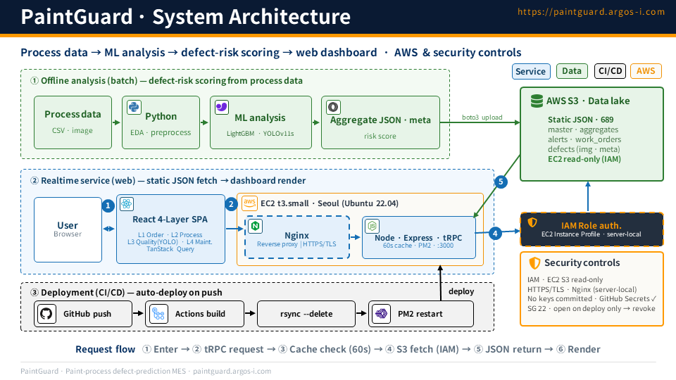

# PaintGuard — AI Defect Inspection & 4-Layer MES for Automotive Paint Shops

**🌐 English · [한국어](README.ko.md)**

**A dual-track ML system that detects paint defects, scores their risk, and serves it through a 4-Layer MES web app — built end-to-end, from models to deployment.**

> A vision model finds the defects; a structured model proves they can't be predicted from process data alone; a weighted risk score turns raw detections into a ranked, on-the-floor action list.

PaintGuard is an automotive paint-shop quality-inspection PoC. It pairs a **YOLO defect detector** with a **structured FAIL-prediction model**, joins the two through a **profile-level risk score**, and surfaces everything in a **4-Layer MES dashboard** (Orders · Process · Quality · Predictive Maintenance) deployed on AWS. Built on mentor-provided data from **Hyundai AutoEver** — synthetic data modeled on real paint-process production data (structured L2 + image L3) — plus KAMP.ai predictive-maintenance data (L4) and statistics-based synthetic order data (L1).

---

## Demo

**▶️ Live: [paintguard.argos-i.com](https://paintguard.argos-i.com)**

*4-Layer MES dashboard with YOLO defect inspection and quantile risk grading (46s).*

https://github.com/user-attachments/assets/2f25b32d-d73e-4d54-979d-16a53afc3a14

---

## Why it exists

Factory-floor MES tools are typically PC-bound and fragmented: no remote visibility, per-machine manual updates, hours to trace history across processes. PaintGuard reframes paint-shop QA as a **single web MES** — one screen for L1–L4, real-time monitoring, and a defect-inspection pipeline that ranks what to fix first.

The harder question underneath: **can paint defects be predicted from process data, or do you need to look at the part?** PaintGuard answers it with data rather than assumption.

---

## Approach — a structured × vision dual track

Two tracks run in parallel and cover each other's blind spots, then merge.

| | **Structured track** (`track_a_data/`) | **Vision track** (`track_a_images/`) |
|---|---|---|
| Goal | Process context · defect priority | Locate & classify real defects |
| Method | EDA → LightGBM FAIL prediction → SHAP | YOLO v8n → v11s (recall-first) |
| Output | Feature importance · honest predictability verdict | Bounding box · class · confidence |
| Limit | Synthetic data has near-zero variance | No shared key to structured records |

**Integration** joins them at the profile level (no shared primary key) and computes a **100-point risk score** → quantile grading → a ranked action list.

End-to-end pipeline: **EDA → LightGBM → YOLO v11s → profile mapping → risk score.**

---

## Vision track — YOLO v8n → v11s, recall-first

The detector is trained on 8 paint-defect classes (`scratch, dent, paint_bubble, paint_drip, dust, orange_peel, crack, gap_fault`), 800 train / 200 val images, with **Ultralytics 8.4.35 / YOLOv11s / 20 epochs / 640px / AdamW**. Upgrading the base model from **v8n to v11s lifted strict-IoU mAP@0.5:0.95 from 0.811 to 0.866 (+5.5 pp)** — the metric that rewards tighter, more reliable boxes.

Validation uses `conf=0.001` for a **recall-first posture** appropriate to defect detection, where missing a defect costs more than a false alarm:

| Metric | v11s | v8n |
|---|---:|---:|
| **Recall** | **0.9975** | 0.9889 |
| Precision | 0.9401 | 0.9628 |
| mAP@0.5 | 0.9875 | 0.9931 |
| **mAP@0.5:0.95** | **0.8656** | 0.8111 |

Per class, `dent` is strongest (mAP@0.5:0.95 **0.982**) and the tight `gap_fault` class hardest (**0.525**). The biggest v8n→v11s gains land on `crack` (+0.117) and `paint_drip` (+0.107) — the defects that matter most.

> **Honest scope note.** The image set covers **8 of 10 defect types and 8 of 12 body zones** — `CLP` (clip-mark), `WLD` (weld-fault), and the L/R quarter panels have **no images**, so the model cannot detect them. That's a data-coverage limit, stated plainly, not a model claim.

*(Bonus: a separate YOLOv11s-cls color classifier over 9 body colors reaches Top-1 = 1.0.)*

---

## Structured track — and why it pointed to vision

This track is a story about **rigor, not accuracy**.

A first LightGBM on the full feature set scored a perfect **AUC 1.0** — a red flag, not a win. SHAP traced it to a single feature, `defect_count`, which only exists *after* a part has already failed: the model was reading the answer. After removing the **five post-FAIL leakage features** (`defect_count, has_critical, has_major, max_rework_min, dominant_defect`) and switching to a **time-based split** (train through 2024-06 on 2.17 M rows, test from 2024-07 on 662 K rows), the honest **CLEAN model scored AUC 0.556** — essentially random, with `shift_hour` the only weak signal.

The conclusion is decisive and data-driven: **the simulated structured data alone cannot predict FAIL** — so the vision track is the viable path. Catching the leakage and reporting the real number, rather than shipping a fake 1.0, is the point.

---

## Integration — one risk score across two tracks

Image detections and structured records share **no primary key**, so they're joined at the **(defect_type × zone) profile level** (a 120-row profile table, 10 types × 12 zones) instead of per-instance. Each detection gets a **100-point risk score**:

| Component | Weight |
|---|---:|
| Defect severity (CRITICAL 40 / MAJOR 25 / MINOR 10) | 40 |
| Night C-shift ratio | 20 |
| Low-humidity ratio | 15 |
| Rework-required ratio | 15 |
| YOLO confidence | 10 |

Scores are graded by **quantile** (q40 / q70 / q90) so the grade mix stays stable across datasets. Across **251 detections** (100% mapping success):

| Grade | Count |
|---|---:|
| 🔴 CRITICAL | 26 |
| 🟠 HIGH | 50 |
| 🟡 MEDIUM | 75 |
| 🟢 LOW | 100 |

The output turns raw bounding boxes into a **ranked, on-the-floor action list** — the bridge from model metrics to operational decisions.

---

## Architecture & tech stack

**Data flow:** raw MES CSV → **`convert_and_upload.py`** (pandas + boto3) → JSON → **S3** → **EC2** (Express/tRPC, reads S3 with a 60 s cache) → **React** client over tRPC.

| Layer | Tools |
|---|---|
| Frontend | React 19 · TypeScript · Vite · Tailwind CSS 4 · Recharts · tRPC client · Zustand |
| Backend | Express 4 · tRPC 11 · Node 24 (port 3000) · DuckDB (line × shift aggregation) |
| Data | S3 JSON snapshots (source of truth in prod) · presigned S3 image URLs |
| ML | YOLOv11s · LightGBM · SHAP · scikit-learn |
| Infra | AWS EC2 (Seoul, `ap-northeast-2`) · Nginx + Let's Encrypt · IAM role for S3 (no keys) |
| CI/CD | GitHub Actions: push → build → rsync → PM2 restart |

The deployed app is the **React + Express** app under `dashboard/dashboard_re/` (an earlier **Streamlit** version under `dashboard/` was the prototype). A Drizzle/MySQL schema exists in-repo, but production reads S3 JSON.

**Deployment** (`.github/workflows/deploy.yml`): on push to `main`, GitHub Actions builds the app (the EC2 box has only 1 GB RAM, so the build runs in Actions, not on the server), `rsync`s the bundle to EC2, and restarts the PM2 process — temporarily opening and then revoking the runner's IP in the security group for a least-exposure SSH deploy.

---

## Results at a glance

- **YOLOv11s** — Recall 0.9975 · mAP@0.5 0.9875 · mAP@0.5:0.95 0.8656 (+5.5 pp over v8n).
- **LightGBM** — caught target leakage (fake AUC 1.0), honest CLEAN AUC 0.556 → data-driven case for vision.
- **Risk score** — 251 detections graded CRITICAL 26 / HIGH 50 / MEDIUM 75 / LOW 100, 100% mapping.
- **Shipped** — live 4-Layer MES at [paintguard.argos-i.com](https://paintguard.argos-i.com), CI/CD to AWS.

---

## Repository structure

| Path | Role |
|---|---|
| `notebooks/model_yolo_v11s_detection.ipynb` | YOLOv11s training + validation (final detector) |
| `notebooks/model_lgbm_fail_prediction.ipynb` | LightGBM FAIL prediction + leakage analysis + SHAP |
| `notebooks/model_profile_mapping.ipynb` | Profile mapping + 100-pt risk score (integration) |
| `notebooks/PROJ2_eda_visualization.ipynb` | Structured EDA |
| `scripts/_yolov11s_train.py` | YOLO v11s train entrypoint |
| `outputs/_*.json` | Machine-readable results (YOLO / LightGBM / profile / color) |
| `dashboard/dashboard_re/` | **Deployed** React + Express (tRPC) 4-Layer MES app |
| `dashboard/` | Streamlit prototype |
| `convert_and_upload.py` | CSV → JSON → S3 data pipeline |
| `.github/workflows/deploy.yml` | CI/CD (build → rsync → PM2) |
| `defect_profile_table.csv` | 120-row (type × zone) profile table |

---

## Limitations & roadmap

This is a PoC on a simulated dataset, and it says so honestly. Known limits: the structured data has near-zero variance (so FAIL isn't predictable from it); image and structured records share no join key (handled by profile mapping); four defect/zone classes have no images; and the app runs on a single EC2 instance with S3-JSON snapshots (no HA, no live DB).

**Where it goes next:**
- **Stage 2 — real data + metadata mapping.** With VIN · timestamp · line-ID keys and equipment-ID event joins, the profile-level mapping becomes true per-instance E2E traceability.
- **Stage 3 — multi-process.** Modularized per process (paint → assembly → inspection → shipping), linked by metadata, to trace cross-process cause-and-effect and pre-empt defects.

---

## Team & Contributions

3-person team, with clear ownership across **modeling, platform, and project direction**.

- **Byeonggab Song ([@sbg0700](https://github.com/sbg0700)) — ML & frontend.** Built the **entire ML stack**: YOLO v8n→v11s defect detection + the YOLO color classifier, LightGBM FAIL prediction + leakage analysis + SHAP, and the profile-mapping / 100-pt risk-score integration — **plus the React 4-Layer MES dashboard frontend** (L01–L04) and the earlier Streamlit prototype.
- **Myeongsun ([@myeongsun125](https://github.com/myeongsun125)) — project lead & coordination.** Served as the team's **control tower** — aligning the structured, vision, and platform tracks, owning planning and delivery cadence, and keeping scope on target. **Led the final presentation and the project's overall narrative.** On the technical side, ran the **L04 predictive-maintenance EDA**.
- **Youngmin Kwon ([@Kwonym0814](https://github.com/Kwonym0814)) — infrastructure & data platform.** AWS infrastructure and the GitHub Actions deploy pipeline (build → rsync → PM2), and the CSV → JSON → S3 data pipeline.
- 
